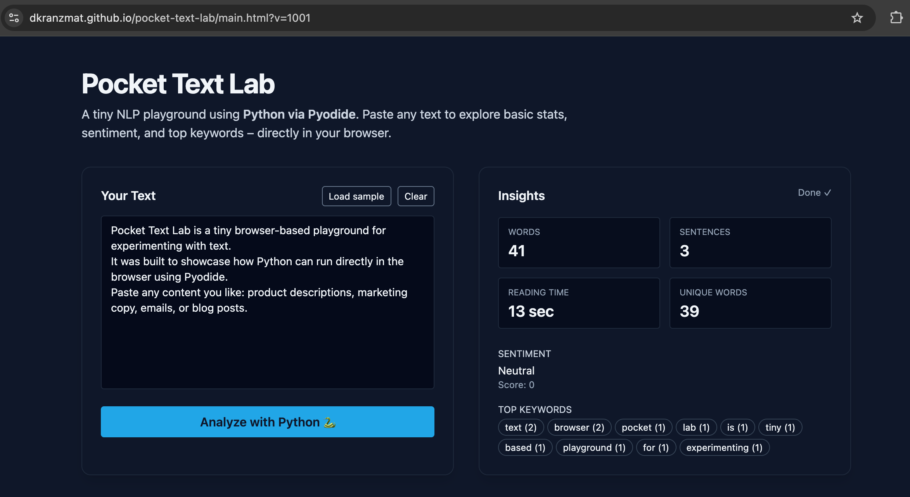

# Pocket Text Lab 🐍✨  
A tiny browser-based NLP playground that runs **real Python directly in your browser** using **Pyodide**.  
Perfect for quick text insights — and a great demo of running Python with zero backend.

---

## 📛 Badges  
  
  
  


---

## 🚀 Live Demo  
🔗 **https://dkranzmat.github.io/pocket-text-lab/main.html**



---

## 🧠 What This Project Demonstrates (For Recruiters)
This project is a strong example of my ability to:

- Build clean and responsive **front-end experiences**  
- Integrate **Python execution inside the browser** (Pyodide)  
- Write hybrid **Python + JavaScript** glue code  
- Create fast, dependency‑free tools deployable via **static hosting**  
- Work around strict GitHub Pages/CORS constraints  
- Debug, refactor, and self-host failing Python runtimes to make them production‑safe  

It’s small — but it shows **problem-solving**, **UI polish**, and **technical range**.

---

## 🧩 Features  
- Word & sentence counts  
- Estimated reading time  
- Lightweight sentiment scoring  
- Top keyword extraction (stopwords filtered out)  
- Smooth UI transitions  
- Zero backend required — runs **fully in the browser**

---

## 🛠️ Tech Stack  
- **Python** (via Pyodide)  
- **HTML / Tailwind CSS**  
- **JavaScript async Python bridge**  
- **GitHub Pages static hosting**  

---

## 📦 Setup (Local or GitHub Pages)
No builds. No installs. Just open the file.

**To run locally:**  
```
open main.html
```

**To deploy on GitHub Pages:**  
- Push to `main`  
- Use `/` or `/docs` as Pages root  
- Append `?v=###` to bust cache during updates

---

## 📁 File Structure  
```
pocket-text-lab/
│
├── main.html        # Full app (UI + Python + JS)
├── index.html       # Redirect shim → main.html
├── pocket-text-lab.png
└── README.md
```

---

## 🧪 How Python Runs in the Browser  
Pyodide loads CPython compiled to WebAssembly.  
Your text is passed to Python → analyzed → results returned back to JS.

Zero server load. Zero APIs. Instant feedback.

---

## 🙌 Credits  
Built by **Dave Kranz** — exploring cool ways to blend Python + frontend.

---

## 📬 Contact / Portfolio  
🔗 GitHub: https://github.com/DKranzMAT  
🔗 Portfolio: https://davidkranzwordpress.com  
🔗 LinkedIn: https://linkedin.com/in/david-kranz

---

## 📝 License  
MIT — free to use, learn from, or remix.
